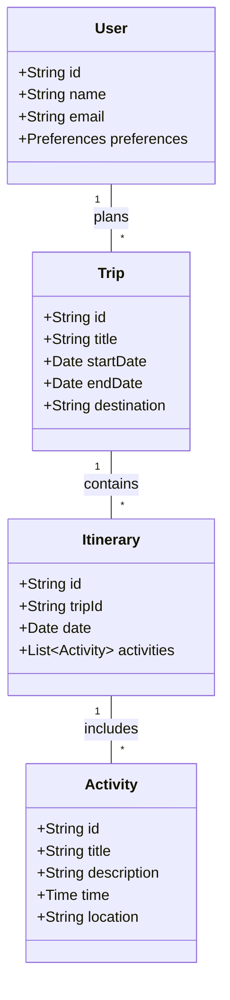

# 3P Architecture Design

## Architectural Choices

The 3P application follows the **Clean Architecture** principles combined with the **MVVM (Model-View-ViewModel)** pattern. This ensures separation of concerns, testability, and scalability.

- **UI Layer (`app/ui`)**: Contains Jetpack Compose screens and ViewModels.
- **Domain Layer (`app/domain`)**: Contains business logic, use cases, and domain models.
- **Data Layer (`app/data`)**: Contains repositories, local database (Room), and remote API clients.

## Data Model Diagram

Below is the domain model diagram representing the core entities of the application.

